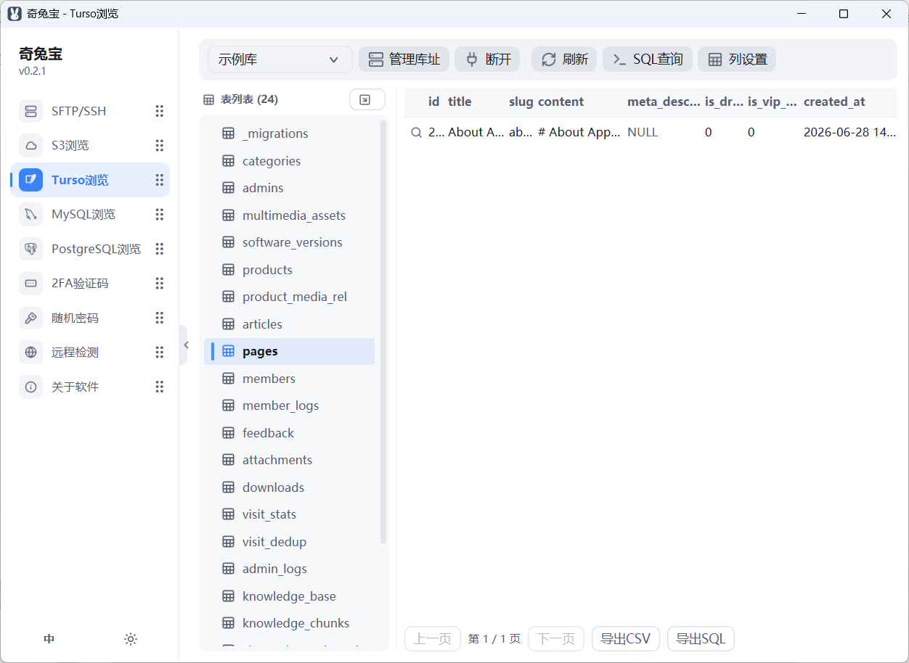
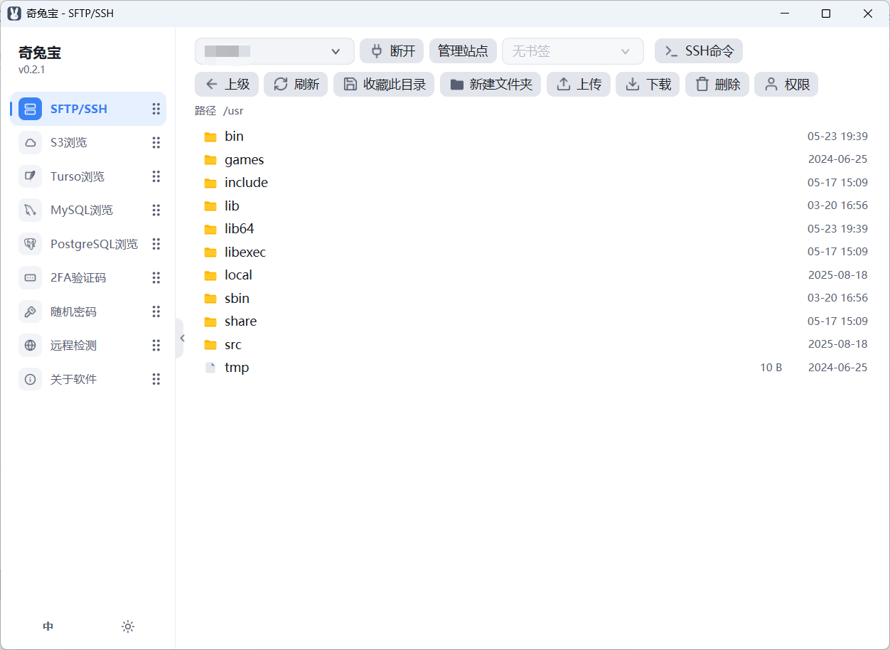

# 奇兔宝 (Qi Toolbox)

> **小身材，大管家 —— 你的随身运维百宝箱。**

---

[English](#english) | [中文](#中文)

---

<a name="中文"></a>

## 中文

轻量级一站式服务器快捷管理工具箱，基于 Rust + windui 构建的原生 Windows / Linux 桌面应用，集 2FA 验证码生成、账号密码加密、数据库浏览（Turso / MySQL / PostgreSQL / Redis）、SFTP 文件管理、S3 对象存储浏览、运维备忘、远程检测（连接 / Ping / SSL 证书 / 响应体 / SEO 分析 / 安全检测）于一体。

### ✨ 亮点

- **一个 exe 走天下**：整个软件仅约 15 MB，单文件绿色版，下载即用，U 盘可携带，不写注册表、无后台进程
- **极致轻量**：整个软件仅约 **15 MB** —— 八大功能模块装进一个文件，比很多软件的一张截图还小
- **原生性能**：纯 Rust 构建，原生 Windows GUI —— 秒级启动、内存占用极低、不卡 UI，彻底告别 Electron 式动辄几百 MB 的臃肿
- **数据只属于你**：TOTP 密钥、SFTP 密码等敏感信息全部本地加密存储（Windows DPAPI / macOS Keychain / Linux 密钥环）
- **从密码到上线的完整链路**：生成密码 → 哈希加密 → 生成 SQL → SFTP 部署 → 远程检测，一个工具贯穿全流程
- **安全体检一体化**：SSL 证书 / 安全响应头 / 敏感路径 / 风险端口 / TLS 旧版本，一键扫描
- **中英双语随行**：跟随系统语言启动，应用内一键切换

### 功能

#### 数据库浏览（Turso / MySQL / PostgreSQL）

- 连接本地 Turso / libSQL / SQLite 数据库文件，或远程 MySQL / PostgreSQL 数据库
- 多库址管理：保存常用连接，快速切换
- 浏览所有表及表结构
- 数据表格展示，支持列过滤和分页
- 内置 SQL 查询编辑器，支持语法高亮
- 数据导出 CSV，整库结构导出 DDL（schema.sql），行详情查看模式
- SQL 只读模式：一键拦截写语句，浏览数据更安心
- 查询管理：常用 SQL 保存 / 复用 / 删除

#### Redis 浏览

- 连接 Redis / Valkey 服务器（RESP 协议通用），多连接管理：保存常用连接，快速切换
- 数据库（db0..dbN）切换浏览，SCAN 分页浏览键列表（不阻塞服务，不 KEEPS 全量键）
- 键详情：类型 / TTL / 值自动按类型展开（STRING 直读，LIST / SET / ZSET / HASH 摘要预览，大值 64 KB 截断）
- 内置命令行：任意 Redis 命令执行，结果表格化展示（支持引号含空格的参数）
- 连接串密码加密存储，展示时自动隐藏

#### S3 对象存储浏览

- 连接 S3 兼容对象存储（AWS S3、MinIO、Cloudflare R2 等）
- Bucket 与对象列表浏览，路径式 / 虚拟主机式寻址可选，支持关键字过滤
- 对象上传 / 下载 / 删除
- 大文件断点续传：上传超 64 MB 自动 Multipart 分片（进度落盘，重传跳过已完成分片）；下载经 Range 从断点续写
- 一键生成预签名分享链接（1 小时有效）

#### SFTP 文件管理

- SSH 密码认证连接，文件列表浏览（目录优先排序）
- SSH 私钥认证：支持 OpenSSH / PEM 等常见格式，密钥口令可选
- 上传 / 下载 / 新建文件夹 / 删除，大文件分块流式传输
- 断点续传：上传 / 下载中断后重试，自动从已传输的字节处继续，已完整的文件跳过重传
- 文件权限设置：对所有者 / 组 / 其他人分别勾选 读、写、执行（chmod）
- 服务器主机密钥指纹校验，防中间人攻击（指纹变化时拒绝连接）
- 复用 SSH 会话执行远程命令
- 内置部署 / 维护常用命令模板（系统状态、服务管理、部署容器、网络），点选即填入命令框

#### 2FA TOTP 验证码生成

- 生成兼容主流平台的 Base32 安全密钥
- 验证码实时滚动刷新（SHA1, 30s 步长），带剩余秒数倒计时条，无需手动重算
- 生成 otpauth:// 二维码，可直接扫码配置 Google Authenticator / Authy
- 支持粘贴 otpauth:// URI 一键导入（迁移 / 备份密钥），导入后立即出码
- 生成后自动复制开关，密钥本地保存，方便重复使用

#### 账号密码加密

- 支持 Argon2id / Bcrypt / PBKDF2 三种主流哈希算法
- 平台预设：Laravel、Django、Spring Boot、Express、ASP.NET Core、Rails、WordPress、Go
- 一键生成 8/12/16 位随机密码（包含大小写字母、数字、特殊字符）
- 自动生成 SQL UPDATE 语句，方便直接应用到数据库
- 哈希校验：粘贴哈希串即可验证密码是否匹配，自动识别算法

#### 远程检测

- 支持 http / https / ws / wss / ftp 地址自动解析（缺省按 https，端口可携带）
- 连接：TCP 建连（加密协议自动 TLS 握手），返回 RTT 与解析到的 IP
- Ping：连测 3 次，输出最小 / 平均 / 最大时延
- SSL 证书状态：证书链校验 + 主题 / 签发者 / 有效期 / 剩余天数（仅 https/wss）
- 响应体：HTTP 状态码 / 响应大小 / 耗时 + 响应体预览，自动跟随重定向（仅 http/https）
- SEO 分析：title / description / keywords / canonical / viewport / H1 / 图片 alt 一目了然（仅 http/https）
- 安全检测：敏感路径暴露 / 安全响应头缺失 / 风险端口开放 / TLS 旧版本兼容，一键扫描分级报告（仅 http/https）
- 端点二维码：一键生成当前地址二维码，扫码即可分发

#### 运维备忘

- 文本备忘的新增 / 编辑 / 删除，本地 Turso（store.db）存储
- 月历选日期：点选日期过滤当天备忘，再点取消；有备忘的日期绿色加粗标记
- 备忘可关联日期（可空），按更新时间倒序展示
- 无标题 / 空内容限制，随手记录更自由

### 界面截图

| 模块 | 截图 |
|---|---|
| 数据库浏览 |  |
| SFTP 文件管理 |  |

### 预编译下载

前往 [Releases](https://github.com/wujianqi/qi-toolbox/releases) 页面下载最新版本。

- `qi-toolbox-<版本>-windows-x64.exe` — 单包双语言：启动跟随系统语言（中文系统→中文，否则英文），可在主面板侧栏底部「中 / EN」手动切换
- `qi-toolbox-<版本>-linux-x64.tar.gz` — Linux (x86_64) 单文件版，解压后 `chmod +x qi-toolbox` 直接运行；基于 glibc 2.35 构建（Ubuntu 22.04+ / Debian 12+ / RHEL 9+ 等），图形走 X11 或 XWayland，文件对话框依赖 xdg-desktop-portal，字体渲染运行期探测 fontconfig（缺失时回退扫描字体目录）
- `qi-toolbox-<版本>-macos-arm64.tar.gz` — macOS (Apple Silicon，macOS 11+) 单文件版，解压后 `chmod +x qi-toolbox` 直接运行；ad-hoc 签名，浏览器下载的首次打开若被 Gatekeeper 拦截，右键 →「打开」一次即可
- `qi-toolbox-<版本>-macos-x64.tar.gz` — macOS (Intel，macOS 10.13+) 单文件版，使用方式同上；macOS 未经充分测试，欢迎反馈问题

### 从源码编译

#### 前提条件

- [Rust](https://www.rust-lang.org/tools/install) (2021 edition)

> Windows 直接 `cargo build --release`；Linux 需要 X11 运行库（Wayland 会话经 XWayland 运行），
> 另需 `pkg-config` + `libdbus-1-dev`（主口令免输功能经 D-Bus 访问系统密钥环，仅编译期需要
> -dev 包；无密钥环环境运行时自动回退每次输口令）。Linux 未经充分测试，欢迎反馈问题。
> macOS 在 Mac 上 `cargo build --release` 即可（Metal 渲染，无需额外依赖）。

#### 编译

```bash
# Debug 版本
cargo build

# Release 版本（体积优化：opt-level=z + fat LTO + strip）
cargo build --release
```

产物位于 `target/release/qi-toolbox.exe`（Windows）/ `target/release/qi-toolbox`（Linux / macOS）。

### 许可证

[MIT License](LICENSE)

---

<a name="english"></a>

## English

Lightweight one-stop server management toolbox — a native Windows / Linux desktop app built with Rust + windui, combining a 2FA authenticator, password hashing, database viewers (Turso / MySQL / PostgreSQL / Redis), an SFTP file manager, an S3 object storage browser, an ops memo pad, and remote checks (connect / ping / SSL certificate / response body / SEO analysis / security scan).

> **Highlights**: the entire app is only ~15 MB — single-file portable build, zero install, no background services; pure-Rust native implementation with instant startup and minimal memory footprint; sensitive data (TOTP secrets, SFTP passwords, etc.) is stored locally with platform encryption (DPAPI on Windows, Keychain on macOS, secret service on Linux); built-in zh/en bilingual UI follows the system language and can be switched in-app.

### ✨ Highlights

- **One exe for everything**: single-file portable build, download and run, USB-stick friendly, no registry writes, no background processes
- **Ultra lightweight**: the entire app is only ~**15 MB** — eight feature modules packed into one file, smaller than a screenshot of many other apps
- **Native performance**: pure Rust with a native Windows GUI — instant startup, minimal memory footprint, silky-smooth UI. Zero Electron bloat (which typically weighs hundreds of MB)
- **Your data stays yours**: TOTP secrets, SFTP passwords and other sensitive data are stored locally with encryption (DPAPI on Windows, Keychain on macOS, secret service on Linux)
- **Full workflow from password to production**: generate password → hash → SQL → SFTP deploy → remote check, all in one tool
- **One-click security scan**: SSL certificate / security headers / sensitive paths / risky ports / legacy TLS, with a graded report
- **Bilingual out of the box**: follows system language, one-click switch in-app

### Features

#### Database Viewer (Turso / MySQL / PostgreSQL)

- Connect to local Turso / libSQL / SQLite files, or remote MySQL / PostgreSQL databases
- Multi-connection management: save frequently used connections for quick switching
- Browse all tables and schema
- Data grid with column filtering and pagination
- Built-in SQL query editor with syntax highlighting
- CSV export, full schema export as DDL (schema.sql), and row detail view
- SQL read-only mode: one-click blocker for write statements, safer browsing
- Query manager: save / reuse / delete frequently used SQL

#### Redis Browser

- Connect to Redis / Valkey servers (universal RESP protocol) with multi-connection management: save frequently used connections for quick switching
- Browse databases (db0..dbN) with SCAN-paginated key listing (non-blocking, no full KEYS sweep)
- Key details: type / TTL / value expanded by type (STRING direct read, LIST / SET / ZSET / HASH summary preview, values over 64 KB truncated)
- Built-in command line: run any Redis command with tabular results (quoted arguments with spaces supported)
- Connection passwords stored encrypted, hidden in display

#### S3 Object Storage Browser

- Connect to S3-compatible object storage (AWS S3, MinIO, Cloudflare R2, etc.)
- Bucket / object listing with path-style or virtual-host addressing, keyword filtering
- Object upload / download / delete
- Resumable transfers for large files: uploads over 64 MB automatically switch to multipart (progress persisted to disk, finished parts skipped on retry); downloads resume via Range from the last byte
- One-click presigned share link (valid for 1 hour)

#### SFTP File Manager

- Password-authenticated SSH connections, directory listing (directories first)
- SSH private-key auth: OpenSSH / PEM and other common formats, optional key passphrase
- Upload / download / mkdir / delete, chunked streaming for large files
- Resumable transfers: retrying an interrupted upload / download continues from the last transferred byte; fully downloaded files are skipped
- File permission settings: check Read / Write / Execute for Owner / Group / Others (chmod)
- Server host-key fingerprint verification against MITM (connection refused on fingerprint change)
- Run remote commands over the existing SSH session
- Built-in deploy/maintenance command templates (system, services, deploy & containers, network), click to fill the command box

#### 2FA TOTP Authenticator

- Generate Base32 secret keys compatible with major platforms
- Live rolling 6-digit TOTP codes (SHA1, 30s step) with a countdown bar — no manual refresh
- Generate otpauth:// QR codes for Google Authenticator / Authy setup
- Paste an otpauth:// URI to import in one click (key migration / backup); the code shows immediately after import
- Auto-copy toggle after generation; save keys locally for reuse

#### Password Hashing

- Supports Argon2id / Bcrypt / PBKDF2 algorithms
- Platform presets: Laravel, Django, Spring Boot, Express, ASP.NET Core, Rails, WordPress, Go
- Generate random passwords (8/12/16 chars) with uppercase, lowercase, digits, and symbols
- Auto-generate SQL UPDATE statements for direct database use
- Hash verification: paste a hash to check if a password matches, with automatic algorithm detection

#### Remote Check

- Auto-parse http / https / ws / wss / ftp URLs (defaults to https, port supported)
- Connect: TCP handshake (auto TLS for encrypted schemes), reports RTT and resolved IP
- Ping: 3 probes with min / avg / max latency
- SSL certificate: chain validation + subject / issuer / validity / days left (https/wss only)
- Web body: HTTP status code / size / elapsed + response body preview, follows redirects (http/https only)
- SEO analysis: title / description / keywords / canonical / viewport / H1 / image alt at a glance (http/https only)
- Security scan: sensitive path exposure / missing security headers / risky open ports / legacy TLS support, one-click graded report (http/https only)
- Endpoint QR code: one-click QR for the current URL, scan to share

#### Ops Memo

- Create / edit / delete text memos, stored in the local Turso store (store.db)
- Calendar date picking: click a date to filter that day's memos, click again to clear; dates with memos are marked in bold green
- Memos can be linked to a date (optional), listed newest-first by update time
- No forced title or content — jot down notes freely

### Screenshots

> Screenshots live in `docs/screenshots/` and are updated with each release.

| Module | Screenshot |
|---|---|
| Database Viewer |  |
| SFTP File Manager |  |

### Download

Visit the [Releases](https://github.com/wujianqi/qi-toolbox/releases) page.

- `qi-toolbox-<ver>-windows-x64.exe` — Single package with built-in zh/en: follows the system language on startup (Chinese system → Chinese, otherwise English), switchable via the 中/EN toggle at the sidebar bottom
- `qi-toolbox-<ver>-linux-x64.tar.gz` — Linux (x86_64) single-file build: extract, `chmod +x qi-toolbox` and run; built against glibc 2.35 (Ubuntu 22.04+ / Debian 12+ / RHEL 9+, etc.), renders via X11 or XWayland, file dialogs need xdg-desktop-portal, fonts probed via fontconfig at runtime (falls back to scanning font directories)
- `qi-toolbox-<ver>-macos-arm64.tar.gz` — macOS (Apple Silicon, macOS 11+) single-file build: extract, `chmod +x qi-toolbox` and run; ad-hoc signed — if Gatekeeper blocks the first launch of a browser download, right-click → Open once
- `qi-toolbox-<ver>-macos-x64.tar.gz` — macOS (Intel, macOS 10.13+) single-file build, same usage; macOS is not extensively tested yet, feedback welcome

### Build from Source

#### Prerequisites

- [Rust](https://www.rust-lang.org/tools/install) (2021 edition)

> On Windows just run `cargo build --release`; on Linux the X11 runtime is required (Wayland sessions run through XWayland), while building needs no system -dev packages at all (windowing/protocols are pure Rust). Linux is less battle-tested — feedback welcome.

#### Build

```bash
# Debug
cargo build

# Release (size-optimized: opt-level=z + fat LTO + strip)
cargo build --release
```

The binary is at `target/release/qi-toolbox.exe` (Windows) / `target/release/qi-toolbox` (Linux).

### License

[MIT License](LICENSE)
